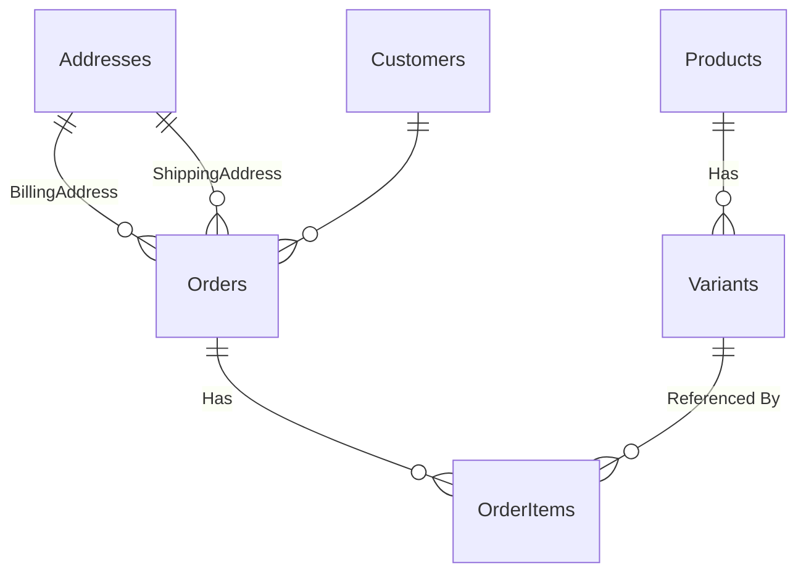

# Entity-Relationship Diagram (ERD)

This markdown file contains a representation of the Entity Framework model as an ER diagram using Mermaid syntax. The diagram illustrates the entities, their fields, and the relationships between them.

If you would like to view this diagram you can open it in VS Code with a mermaid extension.

## Mermaid Diagram

